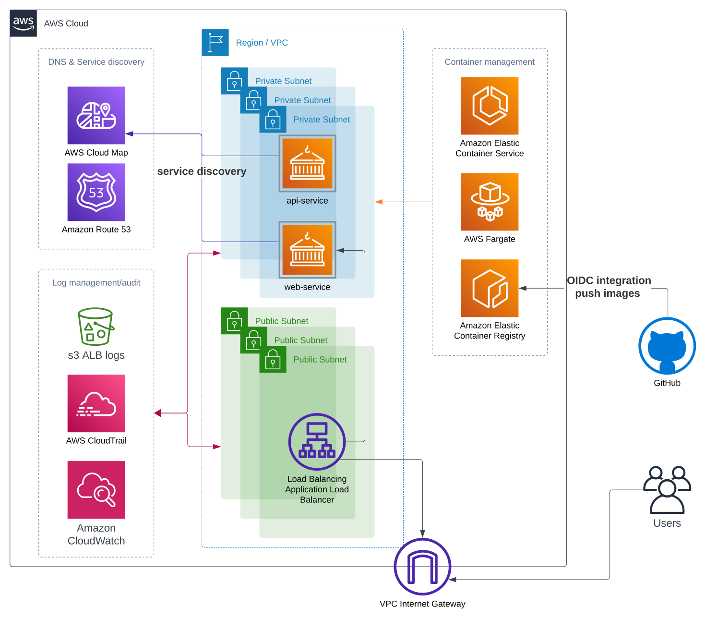

# Pulumi micro stacks project example

## Prerequisites

Before beginning please make sure that you have micro-stack ```data``` with the following content:
```python
import pulumi
pulumi.export('route53_zone_id', "zone_id_should_be_here")
pulumi.export('route53_zone_name', "name_of_public_dns_zone")
```

## Bootstrap
Just simply run [bootstrap](./bootstrap.sh) scrip to select ```dev``` stack

## Run group actions
Use [all.sh](./all.sh) action to perform some action (refresh, up, destroy, etc.) for all stacks in the repository.


# Solution overview

Infrastructure diagram



This project example implements [Micro-Stacks](https://www.pulumi.com/docs/using-pulumi/organizing-projects-stacks/) approach to spin up components independently and improve the speed of applying infrastructure changes by reducing the scope of changing

## Micro-Stacks overview

### [vpc](./vpc/)
Stack to create and manage VPC, based on [AWSx Pulumi Crosswalk for AWS](https://www.pulumi.com/registry/packages/awsx/) to follow [AWS Well-Architected](https://aws.amazon.com/architecture/well-architected/)

### [ecr](./ecr/)
Stack to create and manage [Amazon ECR](https://aws.amazon.com/ecr/) registries, integrate it with GitHub through OIDC provider

### [ecs](./ecs/)
Stack to create and manage [Amazon Elastic Container Service](https://aws.amazon.com/ecs/), also provide HTTP namespace for automatic service discovery within [AWS Cloud Map](https://aws.amazon.com/cloud-map/)

### [data](./data/)
Not presented in the repository. The stack contains information about pre-created [Amazon Route 53](https://aws.amazon.com/route53/) public zone

### [ssl-cert](./ssl-cert/)
Stack to issue SSL/TLS certificate in [AWS Certificate Manager](https://aws.amazon.com/certificate-manager/)

### [app-ingress](./app-ingress/)
Stack to create [Application Load Balancer](https://aws.amazon.com/elasticloadbalancing/application-load-balancer/) in a public subnet, Security Group to allow inbound traffic and link this ALB with A record in Route53 by Alias record

Normally deployed across public VPC subnets

### [app-security-group](./app-security-group/)
Stack to create and manage Security Group to allow communications between services in ECS

### [app-api](./app-api/)
Stack to create [AWS Fargate](https://aws.amazon.com/fargate/) service and run [api](https://github.com/technicaldomain/air-tek-api) service

Normally deployed across private VPC subnets with a defined autoscaling policy

### [app-web](./app-web/)
Stack to create [AWS Fargate](https://aws.amazon.com/fargate/) service and run [web](https://github.com/technicaldomain/air-tek-web) service and expose it to the internet through ALB

Normally deployed across private VPC subnets with a defined autoscaling policy

## License
Apache 2 Licensed. For more information please see [LICENSE](./LICENSE)
